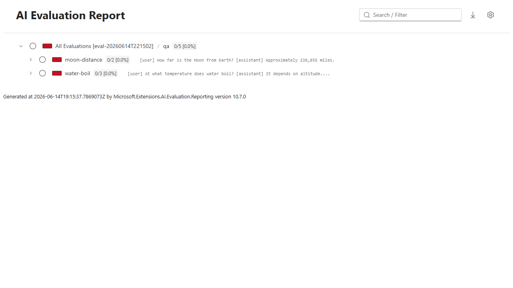

# eval-cli — Presentation

> Each `##` section is a slide. Body text is speaker notes.

---

## 1. What is eval-cli?

**Cross-platform AI evaluation CLI** — a single tool that any team can use to evaluate LLM responses, regardless of their language stack.

- Runs quality evaluators: **Relevance, Coherence, Fluency, Groundedness, Completeness, Equivalence**
- **Zero runtime dependencies** — self-contained native binary or dotnet tool
- Works with **Azure OpenAI** and any **OpenAI-compatible** endpoint (DeepSeek, OpenCode, etc.)
- No code required — pipe JSON in, get scores out
- Standardized evaluators and caching across teams

---

## 2. Single Scenario Evaluation

Evaluate individual LLM responses against quality metrics.

```bash
# Clean and run — captures fresh output every time
rm -rf eval-results

eval-cli \
  --endpoint "https://opencode.ai/zen/go/v1" \
  --model "deepseek-v4-pro" \
  --api-key "$API_KEY" \
  --input integration/scenarios.json \
  --evaluators relevance,coherence,fluency \
  --parallel 3
```

```
presentation-single — 5 scenarios, 5 groups

demo.knowledge.earth-moon (n=1)
  ✅ Relevance: 4.00
  ❌ Fluency: 3.00
  ✅ Coherence: 4.00

demo.knowledge.planet-order (n=1)
  ✅ Relevance: 4.00
  ❌ Fluency: 3.00
  ✅ Coherence: 4.00

demo.reasoning.water-states (n=1)
  ✅ Relevance: 5.00
  ✅ Coherence: 4.00
  ❌ Fluency: 3.00

demo.math.simple-addition (n=1)
  ✅ Relevance: 4.00
  ✅ Fluency: 0.00
  ✅ Coherence: 4.00

demo.reasoning.french-capital (n=1)
  ❌ Fluency: 3.00
  ✅ Coherence: 4.00
  ✅ Relevance: 4.00
```

**What you see:**
- **5 scenarios, 5 groups** (each scenario name is unique)
- Each line shows ✅ pass / ❌ fail with the numeric score
- Fluency flags short or bare responses (the math answer "136" scores 0 — it has no grammar to judge)
- Zero config beyond endpoint + model + input file

---

## 3. Multi-Run Aggregation

LLMs are non-deterministic. One run isn't enough. Run the same prompt multiple times and see the variance.

```bash
# Clean and run
rm -rf eval-results

eval-cli \
  --endpoint "https://opencode.ai/zen/go/v1" \
  --model "deepseek-v4-pro" \
  --api-key "$API_KEY" \
  --input integration/multi-run-scenarios.json \
  --evaluators relevance,coherence \
  --parallel 3
```

```
presentation-multi — 5 scenarios, 2 groups

qa.water-boil (n=3)
  ✅ Coherence: 4.00 ± 0.00  [4.00–4.00]
  ✅ Relevance: 4.33 ± 0.58  [4.00–5.00]

qa.moon-distance (n=2)
  ✅ Relevance: 4.00 ± 0.00  [4.00–4.00]
  ✅ Coherence: 4.00 ± 0.00  [4.00–4.00]
```

**What the stats tell you:**

| Pattern | Meaning |
|---------|---------|
| High mean, low std dev | Consistently good |
| High mean, high std dev | Usually good, occasionally bad — **flaky** |
| Low mean, low std dev | Consistently bad — prompt is a weakness |
| Low mean, high std dev | Inconsistent — sometimes ok, mostly not |

**Std dev is arguably more important than mean.** A model with 4.0 ± 0.2 is more *reliable* than one with 4.5 ± 1.5.

---

## 4. Results Folder — What's on Disk

Every run persists results automatically. No flag needed.

```
eval-results/
  cache/                              ← library-managed response cache
  results/
    presentation-multi/               ← execution-scoped folder (library-native format)
      qa.moon-distance/
        1.json          ← individual run 1: per-metric scores with ratings
        2.json          ← individual run 2
      qa.water-boil/
        1.json
        2.json
        3.json
  stats/
    presentation-multi/               ← aggregated stats (added by eval-cli)
      qa.moon-distance/
        _stats.json     ← mean, std dev, min, max, failed fraction
      qa.water-boil/
        _stats.json
```

**Each file:**
- `{iteration}.json` — library-native `ScenarioRunResult` (managed by `DiskBasedResultStore`)
- `_stats.json` — `AggregatedScenario` (mean, stdDev, min, max, failedFraction per metric)

**Folder is self-contained** — `aieval report` reads `results/` for individual runs; our `stats/` captures the aggregate picture.

---

## 5. Rich HTML Reports via aieval

`eval-cli` writes results in the library's native format. Use the official `aieval` CLI to generate rich, interactive HTML reports — no extra export step needed.

```bash
# 1. Run evaluation (results saved to eval-results/ automatically)
eval-cli \
  --endpoint "https://opencode.ai/zen/go/v1" \
  --model "deepseek-v4-flash" \
  --api-key "$API_KEY" \
  --input integration/scenarios.json \
  --evaluators relevance,coherence,fluency \
  --name "baseline"

# 2. Generate HTML report from the same storage path
dotnet tool install Microsoft.Extensions.AI.Evaluation.Console --create-manifest-if-needed
dotnet aieval report -p ./eval-results -o report.html --open
```



**What you get:**
- Interactive HTML with per-metric scores, ratings, and evaluator reasoning
- Execution-level grouping — run multiple evaluations with different `--name` values for trend comparison
- Iteration drill-down — same-name scenarios grouped with individual run detail
- Zero config — `aieval` reads the same `eval-results/` directory `eval-cli` writes to
